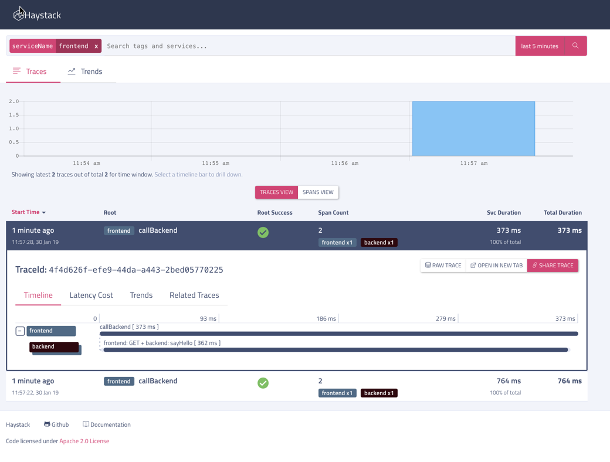
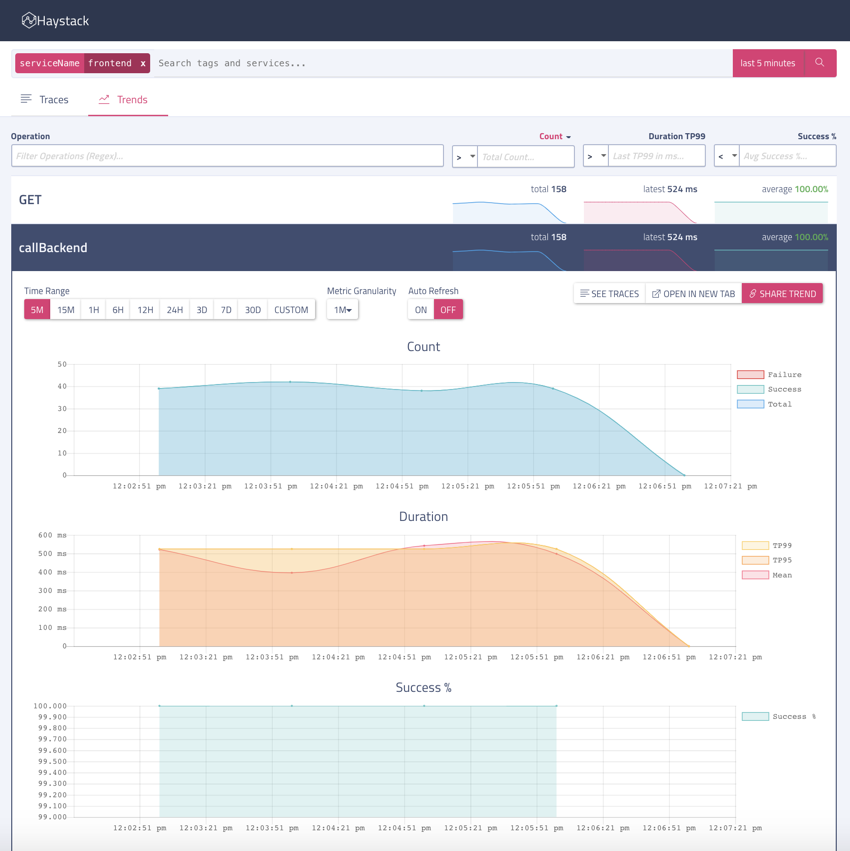

## Opentracing-spring-haystack-web-starter example

In this example, the two spring controllers call one from another to show a client and server working with tracing instrumentation. Telemetry from this application is recorded in [Haystack](http://expediadotcom.github.io/haystack/) server, a distributed tracing system. Haystack will allow one to see the service call dependency and how long it took for the whole operation to complete. Here is what a sample output in the UI will look like: 



## About this example

This is a very basic example that can output the instrumentation to console and/or a Haystack server. This is an example application written with two simple Spring controllers to show how a spring application can be instrumented with [opentracing-spring-haystack-web-starter](https://github.com/ExpediaDotCom/haystack-client-java/tree/master/integrations/opentracing-spring-haystack-web-starter). 

* Controller one:  Backend.  This listens on port 9091 and exposes one endpoint : http://localhost:9091/api/hello - when invoked, it returns a simple string like `Hello, It's Wed Jan 30 11:06:37 PST 2019`

* Controller two:  Frontend:  This listens on port 9090 and exposes one endpoint: http://localhost:9090/hello  - this in turn calls the endpoint exposed by `Backend` and proxy the response

### Instrumentation

If one peeks into the code, both [Frontend.java](src/main/java/com/expedia/haystack/opentracing/spring/example/Frontend.java) and [Backend.java](src/main/java/com/expedia/haystack/opentracing/spring/example/Backend.java) are simple Spring controllers with no additional instrumentation code.  Most of the instrumentation is done by the dependency `opentracing-spring-haystack-web-starter`, that is included in the [pom.xml](pom.xml). For more information how this library works, one can check the documentations at [https://github.com/opentracing-contrib/java-spring-cloud](https://github.com/opentracing-contrib/java-spring-cloud) and [https://github.com/ExpediaDotCom/haystack-client-java/tree/master/integrations/opentracing-spring-haystack-web-starter](https://github.com/ExpediaDotCom/haystack-client-java/tree/master/integrations/opentracing-spring-haystack-web-starter)


## Running this example

Required:

* Java 1.8


Build:

```bash
./mvnw clean compile
```

There are two modes to run the application. One with no `Haystack` server, where the instrumentation is simply logged to the console and with Haystack server.

### With no backend

In this mode, the application runs with the configuration in [application.yml](src/main/resources/application.yml) which configures the instrumentation to use a simple logger as the dispatcher.

To run the example in this mode, execute 

```bash
./mvnw exec:java -Dstart-class=com.expedia.haystack.opentracing.spring.example.Backend 
./mvnw exec:java -Dstart-class=com.expedia.haystack.opentracing.spring.example.Frontend
```

and send a sample request

```bash
curl http://localhost:9090/hello
```

With that, one will see two lines in the console log of `Frontend`. One for the request it received from the `curl` with `span.kind=server` and one for the request it sent to the backend with `span.kind=client`

Front end:

```
   2019-01-30 11:33:34.679  INFO 99714 --- [nio-9090-exec-1] span-logger                              : {},707ab6be-79b3-49e9-ad16-0894dfe4267a,ef38e68f-94d7-488b-9430-1ca9339a2a64,2967e7f0-3356-4262-a1f6-f307999425a9,false,GET,{http.status_code=200, component=java-spring-rest-template, span.kind=client, http.url=http://localhost:9091/api/hello, peer.port=9091, http.method=GET},[],[child_of,{},707ab6be-79b3-49e9-ad16-0894dfe4267a,2967e7f0-3356-4262-a1f6-f307999425a9,<null>,false],149000,1548876814679000,1548876814530000,true,[]
   2019-01-30 11:33:34.745  INFO 99714 --- [nio-9090-exec-1] span-logger                              : {},707ab6be-79b3-49e9-ad16-0894dfe4267a,2967e7f0-3356-4262-a1f6-f307999425a9,<null>,false,callBackend,{http.status_code=200, component=java-web-servlet, span.kind=server, http.url=http://localhost:9090/hello, http.method=GET},[868766461349835,{handler.class_simple_name=Frontend, handler=public java.lang.String com.expedia.haystack.opentracing.spring.example.Frontend.callBackend(), event=preHandle, handler.method_name=callBackend}, 868766700946419,{event=afterCompletion, handler=public java.lang.String com.expedia.haystack.opentracing.spring.example.Frontend.callBackend()}],[],267000,1548876814745000,1548876814478000,true,[]
```

And one line in the backend console log for the request it received from the front end application. Another point to note will be the same ids between client and server.

```
   2019-01-30 11:33:34.678  INFO 99244 --- [io-9091-exec-10] span-logger                              : {},707ab6be-79b3-49e9-ad16-0894dfe4267a,ef38e68f-94d7-488b-9430-1ca9339a2a64,2967e7f0-3356-4262-a1f6-f307999425a9,false,sayHello,{http.status_code=200, component=java-web-servlet, span.kind=server, http.url=http://localhost:9091/api/hello, http.method=GET},[868766521744239,{handler.class_simple_name=Backend, handler=public java.lang.String com.expedia.haystack.opentracing.spring.example.Backend.sayHello() throws java.lang.InterruptedException, event=preHandle, handler.method_name=sayHello}, 868766641580836,{event=afterCompletion, handler=public java.lang.String com.expedia.haystack.opentracing.spring.example.Backend.sayHello() throws java.lang.InterruptedException}],[child_of,{},707ab6be-79b3-49e9-ad16-0894dfe4267a,ef38e68f-94d7-488b-9430-1ca9339a2a64,2967e7f0-3356-4262-a1f6-f307999425a9,true],123000,1548876814678000,1548876814555000,true,[]
```


## with Haystack server

To start haystack and agent locally, one can follow the instructions at [https://github.com/mchandramouli/haystack-docker#to-start-traces-and-trends](https://github.com/mchandramouli/haystack-docker#to-start-traces-and-trends)
 
After starting Haystack server, run this example with the following commands. This starts the application with the configuration in [application-remote.yml](src/main/resources/application-remote.yml)

```bash
./mvnw exec:java -Dstart-class=com.expedia.haystack.opentracing.spring.example.Backend -Dspring.profiles.active=remote
./mvnw exec:java -Dstart-class=com.expedia.haystack.opentracing.spring.example.Frontend -Dspring.profiles.active=remote
```

and send a sample request

```bash
curl http://localhost:9090/hello
```

And then open Haystack UI at [http://localhost:8080/](http://localhost:8080/) and search for `serviceName=frontend` to see the traces. (see screenshot above)

One can also use the sample script we have to send more requests to the sample application and see metrics such as count, duration histogram etc in Haystack UI under trends.

```bash
./run.sh
```

Screenshot of the trends view with computed metrics:




   
